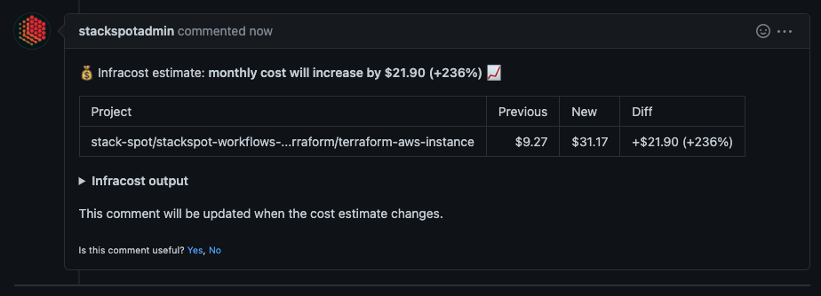
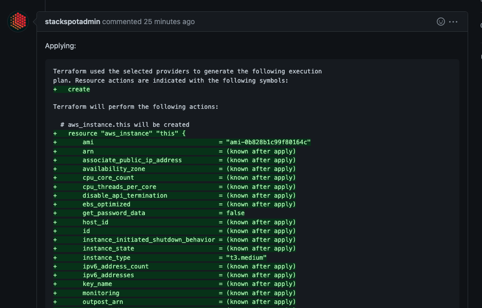
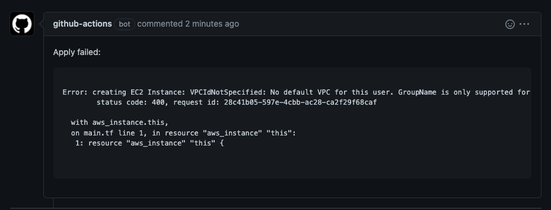

# Reusable IaC Workflows

## About

This repository contains [reusable workflows][rw] to be used to create and manage resources on AWS using [Terraform][terraform].

## How to use

You must create a workflow file in your own repository and you may call the reusable workflow.

### How it works

The workflow you run:

**When you create a PR**
- lint to check and validate your terraform code
- initialization to set yout terraform backend and basic configs
- planning
- create a [cost projection][infracost] for your deploy

Example:



**When you merge to main**
- create a plan file
- apply your terraform project

Example:



When it fails:



### Dependencies

- Github Repository
- Self hosted runner group (with IAM roles atached)

### Configuration

Create the file **.github/wotkflows/myworkflow** and call the reusable workflows as below:

```yaml
name: Testing - Reusable Workflow

on:  
  push:
    branches:
      - main
  pull_request:

jobs:
  call-reusable-workflow:    
    uses: stack-spot/stackspot-workflows/.github/workflows/terraform.yaml@5c5e0e05729332f624c396dd221c5fba2e685693 ###ref example
    with:
      runner_group: runner-group-name
      working_directory: terraform/
      github_event_name: ${{ github.event_name }}
      tag: $GITHUB_RUN_NUMBER
    secrets:
      AWS_ACCOUNT_ID: ${{ secrets.AWS_ACCOUNT_ID_SANDBOX }}
      AWS_REGION: ${{ secrets.AWS_REGION_SANDBOX }}
      GIT_PIPE_TOKEN: ${{ secrets.GIT_PIPE_TOKEN }}
      INFRACOST_API_KEY: ${{ secrets.INFRACOST_API_KEY }}

```

### Parameters

|parameter          |description                                     |
|-------------------|------------------------------------------------|
| runner_group      | The name of the Self hosted Runner group       |
| working_directory | The path of your terraform files               |
| AWS_ACCOUNT_ID    | The identifier of the AWS account              |
| AWS_REGION        | The region where the resources will be applied |
| GIT_PIPE_TOKEN    | Github token for the workflow                  |
| INFRACOST_API_KEY | The API Key of the Infracost which will be used|

## Support

Stacks Environment Team

[rw]: https://docs.github.com/en/actions/using-workflows/reusing-workflows
[terraform]: https://www.terraform.io/docs
[infracost]: https://www.infracost.io
